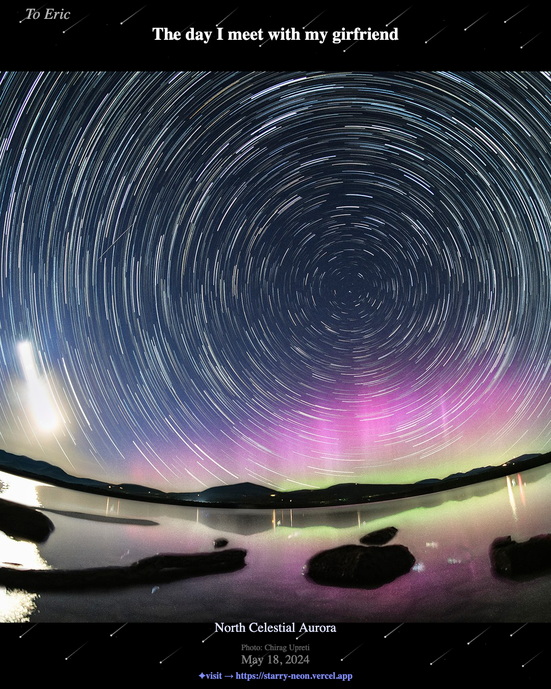
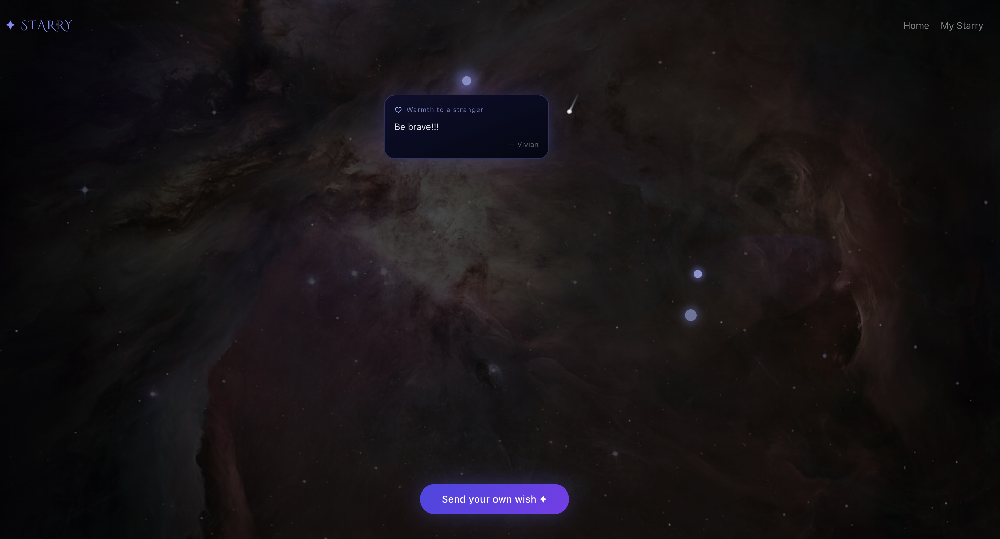

# ✦ Starry 

> *What did the universe look like on the day that mattered most to you?*

Starry connects your life's important moments to NASA's astronomy photos. Enter a date — a birthday, a first meeting, a milestone — and see the cosmic snapshot from that exact day. Turn it into a shareable card, or send a wish into the stars.

🔗 **[starry-neon.vercel.app](https://starry-neon.vercel.app)**

---

## What It Does

| Feature | Description |
|---------|-------------|
| 🌌 **Cosmic Memory Card** | Pick a meaningful date → get the NASA photo from that day → generate a personalized card to share |
| 💫 **Meteor Shower Wishes** | Send an anonymous wish (to yourself, a stranger, or the universe) — watch it fly across the stars |
| ⭐ **My Starry** | Your personal timeline of every date + photo you've saved |
| 🎁 **Gift a Starry** | Send someone a surprise — their special date wrapped in a cosmic card |

---

## Screenshots

### Your moment, framed by the cosmos



*May 18, 2024 — the day Eric met his girlfriend. NASA captured a star trail aurora over a lake that night.*

---

### Meteor Shower Wishes 



*Anonymous wishes fly across the Orion Nebula as shooting stars. Click any meteor to read the message inside.*

---

## How It Works

```
1. Enter a date  →  2. See NASA's photo from that day  →  3. Add your note / name
        ↓
4. Generate a shareable card  →  5. Save to your timeline or send as a gift
```

---

## Tech Stack

| Layer | Choice |
|-------|--------|
| Frontend | Next.js (App Router) + TypeScript + Tailwind CSS |
| Database & Auth | Supabase (PostgreSQL + Magic Link) |
| Image Source | NASA APOD API |
| Card Generation | Browser-side Canvas API |
| Deployment | Vercel |

---

## Local Setup

```bash
# 1. Clone & install
git clone https://github.com/your-username/starry.git
cd starry
npm install

# 2. Add environment variables
cp .env.example .env.local
# Fill in: NEXT_PUBLIC_SUPABASE_URL, NEXT_PUBLIC_SUPABASE_ANON_KEY, NASA_API_KEY

# 3. Run
npm run dev
```

Open [http://localhost:3000](http://localhost:3000).

---

*Built with curiosity — because every moment has a sky above it.*
